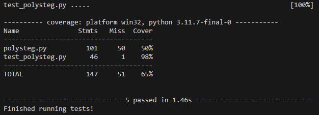

# Information
Welcome to our Polynomial-based Steganography project!

Our group is comprised of Logan McDonald, Taylor Carlson, Garret Snitchler, and Thadd Post

Logan and Thadd worked on the code side of the project, creating a python script that allows a user to encrypt and 
decrypt messages. The encryption algorithm encrypts a message, saves it to a file of the user's choice, and then 
outputs the polynomial key. The decryption algorithm has a user choose a file to decrypt, and then input the key.

Taylor and Garret worked on the report. They outlined the problem we wanted to address, motivation, and objectives 
of our project while also doing research to highlight the background and integrity of the idea we are pursuing.

## Execution
To excute this python code, you first need to have Python 3 or greater installed. You also need to be using python
3.10.8 as the interpreter version. (It may work with other versions of python, but this is the recommended version.)

### Procedure
1. Open a terminal in the same directory as `polysteg.py`
2. Install any requirements using the command `pip install -r requirements.txt` or `pip3 install requirements.txt`
3. Once requirements are installed, run the command `python polysteg.py` or `python3 polysteg.py`
4. From there, you will be prompted to either encode text or decode a file.

### Testing
To run the tests for this code, you can run the following command: 
`python test_polysteg.py` or `python3 test_polysteg.py`

Results of getting code coverage using the `pytest-cov` library can be seen below:

The apparent low coverage of `polysteg.py` is due to not testing the user inputs, not testing the exception catch branches, and not testing the `plot_polynomial_with_grid(...)` method.